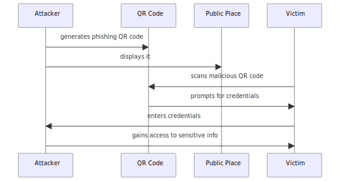
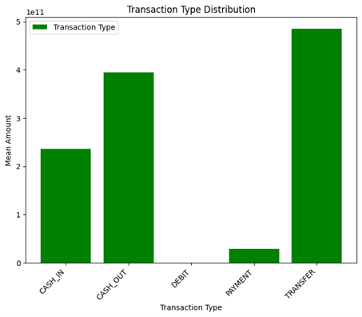
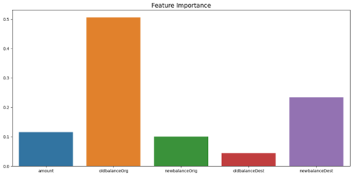
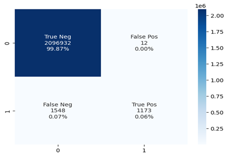
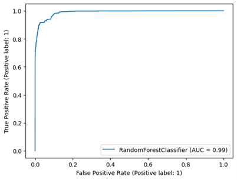

# QRShield: Secure QR Code Payment Ecosystem with Fraud Detection Model

## 📌 Overview

The **QRShield** project focuses on building a **machine learning-based model** to enhance the security of QR code payment systems by detecting and preventing fraudulent transactions. Using a **Random Forest Classifier** trained on a financial transaction dataset, QRShield identifies potentially fraudulent activities in real time. The classified data is embedded into QR codes for secure payment execution.

This solution integrates:

* **Machine learning fraud detection models**
* **Dynamic QR code generation**
* **End-to-end encryption and secure protocols**

Our role in this project is the development and integration of the **fraud detection model** within the secure payment ecosystem.

---

## 🎯 Objectives

* **Analyze vulnerabilities** in QR code payment transactions.
* **Develop a fraud detection model** using Random Forest on financial datasets.
* **Embed transaction verification results** into dynamic QR codes.
* **Integrate the model into QRShield** for real-time fraud prevention.
* **Evaluate model performance** using accuracy, precision, recall, and feature importance.

---

## 🚀 Features

* **Random Forest Fraud Detection Model** trained on Kaggle PaySim dataset.
* **Dynamic QR Code Embedding** with transaction classification results.
* **Automatic flagging of suspicious transactions**.
* **Secure scanning & decoding** of QR codes with fraud status.
* **Encryption & secure protocols** for data integrity.

---

## 🛠 System Architecture

**Core Components:**

* **Random Forest Model** (20 estimators) – fraud detection engine.
* **QR Code Generator** – encodes classified transaction data.
* **QR Code Scanner & Decoder** – reads encoded data.
* **Backend API** – handles classification requests and responses.
* **Database** – stores historical transaction and classification data.

**Workflow:**

1. Input transaction data is collected from payment app.
2. Data is preprocessed and fed into the Random Forest classifier.
3. Model predicts fraud probability.
4. Classification result is embedded into a dynamic QR code.
5. Merchant scans QR code for transaction execution.
6. Fraudulent transactions are flagged for review or automatic block.

---

## 📊 Dataset

* **Source**: [Kaggle PaySim Dataset](https://www.kaggle.com/datasets/ntnu-testimon/paysim1)
* **Description**: Simulated financial transaction dataset designed for fraud detection.
* **Features Used**: transaction type, amount, oldbalanceOrg, newbalanceOrig, oldbalanceDest, newbalanceDest.
* **Fraud Label**: Binary classification (fraudulent vs non-fraudulent).
### Fraud QR

### Non-Fraud QR

---

## 🔍 Model Development

**Random Forest Classifier (200 estimators):**

* Reduces overfitting by combining multiple decision trees.
* Handles imbalanced datasets by stratified sampling.
* Provides feature importance to identify key fraud indicators.

**Key Features Identified:**

* `oldbalanceOrg` – highest importance in predicting fraud.
* `newbalanceDest` – second most important.
* `amount` – moderate influence.
* 

Model performance:

* **Accuracy**: 99.98%
* **Precision & Recall**: Balanced to minimize false positives.

---

## 🔗 QR Code Integration

* Model output is embedded in dynamic QR codes.
* Encoded information includes fraud risk flag.
* Merchant-side scanner reads QR code and verifies fraud status before executing payment.

---
